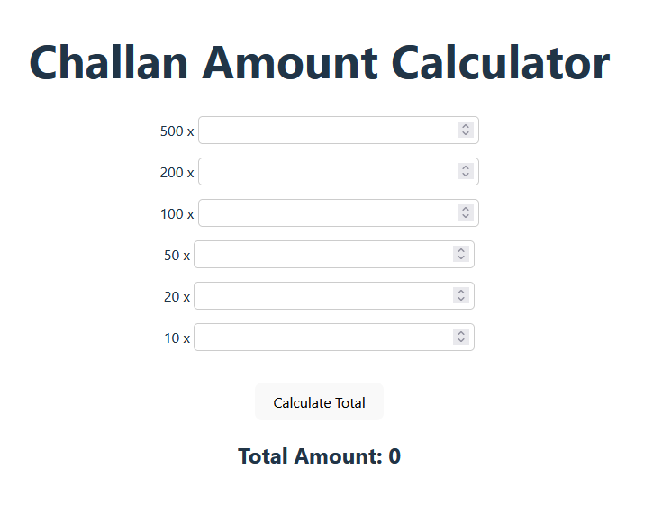
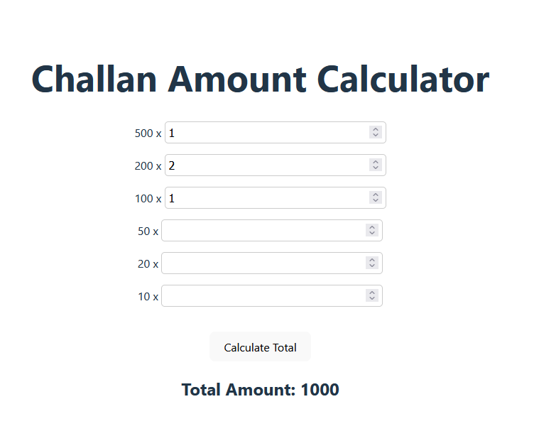

# react_challan_calculator
 
To create a challan amount calculator in a Vite application, you can use a simple form with inputs for each denomination (500, 200, 100) and calculate the total amount based on the entered quantities. Here’s how you can implement it:

### 1. Set Up Your Vite Application
Start by creating a new Vite project if you haven’t done so already:

```bash
npm create vite react_challan_calculator
√ Select a framework: » React
√ Select a variant: » JavaScript

Scaffolding project in C:\Users\windows_rig3\Desktop\react_challan_calculator...

Done. Now run:

  cd react_challan_calculator
  npm install
  npm run dev
```



